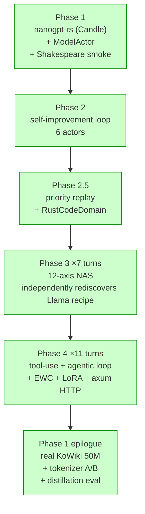
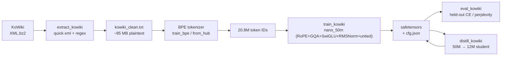
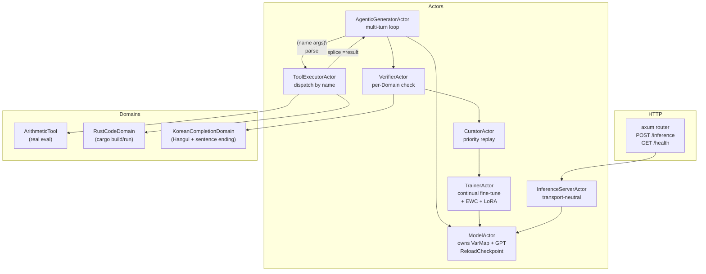

# workLLM — Rust × Pekko Self-Evolving Agentic Foundation Model

A from-scratch Rust implementation of nanoGPT-style transformers stacked with
the Apache Pekko (Akka-like) actor framework, plus a 12-axis neural
architecture search and a self-improvement loop with tool use. Built across
11 phases as a real project, with end-to-end training validated on Korean
Wikipedia.

> **Vision:** "Rust nanoGPT × Pekko-Rust self-evolving Agentic Foundation
> Model." Each phase ships infrastructure that the next phase composes.

## TL;DR

| You can ... | by running ... |
|-------------|----------------|
| Train a GPT (RoPE+GQA+SwiGLU+RMSNorm+untied) on Shakespeare | `cargo run -p nanogpt-rs --example train_shakespeare --features cuda --release` |
| Watch evolutionary NAS rediscover the Llama recipe (12-axis search) | `cargo run -p llm-actors --example evolve_arithmetic --features cuda --release` |
| Run an agentic loop that detects, dispatches, and splices tool calls | `cargo run -p llm-actors --example agentic_arithmetic --release` |
| Self-improve a model with EWC + replay + LoRA on a verified domain | `cargo run -p llm-actors --example self_improve_tool_use --features cuda --release` |
| Train a 50M Korean LM on a real KoWiki dump | `cargo run -p nanogpt-rs --example train_kowiki --features cuda --release` |
| Distill a 50M teacher to a 12M student (KL, T=2, α=0.7) | `cargo run -p nanogpt-rs --example distill_kowiki --features cuda --release` |
| Compare a self-trained vs HuggingFace-pretrained Korean BPE | `cargo run -p nanogpt-rs --example compare_tokenizers --release` |
| Serve inference over HTTP (axum) | `cargo run -p llm-actors --example serve_inference --release` |

**119 unit tests, 20 worked examples, 11 phases + Phase 5/6/7/8/9/10/11 sessions. Phase 11 S4 — DPO multi-round collapse is robust to β ∈ {0.01–0.1} and rolling reference: every variant has round-1 eval = 0/24. β=0.01 recovers to SFT baseline by round 3 (net DPO benefit = 0); β ≥ 0.03 never recovers. Pure DPO is not an SFT replacement at 1M K9 scale; Phase 11 S5 will test hybrid SFT+DPO loss and round-0-only "DPO seed boost". S3 round-0 +41.7pp signal is real but unsustained. Phase 11 S2 wired DPO into the actor loop end-to-end. Phase 10 S3 closed Phase 10. Phase 9 S5 closed the external loop. CUDA 12.5 toolchain pinning required (driver 555). Zero clippy warnings under `-D warnings`, zero fmt drift.**

## Phase lineage



## Data flow (Korean training pipeline)



## Agent architecture (Phase 4)



## Phase Map

| Phase | Deliverable | Tests | Highlight |
|------:|-------------|------:|-----------|
| 1     | `nanogpt-rs` (Candle) + `ModelActor` + Shakespeare + **KoWiki 50M** | 14 | Full Rust training pipeline incl. real Korean Wikipedia |
| 2     | 6-actor self-improvement loop (Generator/Verifier/Curator/Trainer/Evaluator/Supervisor) | 4 | Hot-reload checkpoints via `pekko-persistence` |
| 2.5   | Priority replay + `RustCodeDomain` (cargo-build verifier) | 8 | Domain pluggability validated |
| 3 ×7  | 12-axis NAS that **rediscovers Llama recipe** | 32 | RoPE+GQA+MoE+SwiGLU+RmsNorm-Pre+untied head, fitness 0.49 |
| 4 ×11 | tool-use head, agentic loop, distillation, EWC, real Fisher, full LoRA | 60+ | Self-evolving agent infrastructure complete |

**119 unit tests, 20 worked examples, 11 phases + Phase 5/6/7/8/9/10/11 sessions. See the run-order list below.**

## What it does

- **Trains** decoder-only transformers on Candle (CUDA via candle-core),
  matching the GPT-2/Llama recipe (RoPE rotary embeddings, grouped-query
  attention, SwiGLU/GeGLU, RMSNorm pre-norm, weight-tied or untied head).
- **Evolves** architectures through random→mutated→crossover populations,
  parallelizing per-variant training across GPUs. Phase 3 demonstrated NAS
  independently choosing the modern Llama-2-style stack from a search
  space that included GPT-2-style alternatives at every axis.
- **Self-improves** via a multi-actor pipeline:
  generator → verifier → curator (priority replay) → trainer → reload →
  evaluator. Implemented EWC (real diagonal Fisher), LoRA (per-Linear with
  base freezing), Experience Replay, and weight-anchor regularization.
- **Acts** through tool-use grammar `(name args)\n` parsed by
  `parse_first_tool_call` and dispatched by a `ToolExecutorActor`.
  `AgenticGeneratorActor` runs the multi-turn agent loop with proper
  resolved-call skipping.
- **Speaks Korean** (smoke-validated): trains a 16K-vocab BPE tokenizer
  from a KoWiki dump, then a 46.8M-param Llama-recipe model on the
  tokenized corpus.

## Crates

```
workLLM/
├── nanogpt-rs/              # GPT model + tokenizer + training + EWC + sampling
│   └── src/
│       ├── config.rs        # GPTConfig + presets, 12 architectural axes
│       ├── model.rs         # GPT, Block, MLP, CausalSelfAttention, FeedForward (MoE), Norm wrapper, LoRA
│       ├── tokenizer.rs     # CharTokenizer + HF BPE training
│       ├── data.rs          # TokenDataset
│       ├── train.rs         # AdamW + cosine LR + EWC + LoRA freezing
│       ├── ewc.rs           # WeightAnchor with optional diagonal Fisher
│       └── generate.rs      # temperature/top-k/top-p sampling (greedy fix)
├── llm-actors/              # pekko-rust actor wrappers
│   └── src/
│       ├── model_actor.rs   # owns VarMap + GPT, ReloadCheckpoint
│       ├── trainer_actor.rs # spawn_blocking continual fine-tune (LoRA-aware)
│       ├── curator_actor.rs # priority replay buffer
│       ├── generator_actor.rs
│       ├── verifier_actor.rs
│       ├── evaluator_actor.rs
│       ├── supervisor.rs    # 1-round Gen→Verify→Curate→Train→Reload→Eval
│       ├── evolution.rs     # SearchSpace + Variant + EvolutionRunner (multi-GPU)
│       ├── tools/           # Tool trait + ToolRegistry + ArithmeticTool
│       ├── tool_executor_actor.rs
│       ├── agentic_generator_actor.rs   # multi-turn tool dispatch
│       ├── inference_server_actor.rs    # transport-neutral RPC skeleton
│       └── domain/
│           ├── arithmetic.rs       # SeedMode (Full/NoCarry/None)
│           ├── tool_use.rs         # ToolUseArithmeticDomain
│           └── rust_code.rs        # cargo-verified
└── data/kowiki/             # Korean Wikipedia plaintext (extracted)
```

## Examples (run order)

All examples use CUDA when built with `--features cuda`. Required env:

```bash
export CUDA_HOME=/usr/local/cuda-12.5
export PATH=/usr/local/cuda-12.5/bin:$PATH
```

(Driver 555 / CUDA 12.5; cuda-12.9 toolkit produces incompatible PTX.)

### 1. Train a small char-level model on Shakespeare

```bash
curl -L -o data/input.txt \
  https://raw.githubusercontent.com/karpathy/char-rnn/master/data/tinyshakespeare/input.txt

cargo run -p nanogpt-rs --example train_shakespeare --features cuda --release
```

Loss starts near `ln(vocab=65)=4.17` and converges quickly. ~90s for 2k
steps on an A100; reaches `train≈2.7` and produces Shakespeare-flavored
text.

### 2. Self-improve loop on arithmetic (toy)

```bash
cargo run -p llm-actors --example self_improve_round --features cuda --release \
  -- --rounds 4 --seed-mode nocarry --curator-mode priority --recency-decay 0.95
```

Pretrains on a curriculum subset, then runs Gen→Verify→Curate→Train→
Reload→Eval rounds. With `--seed-mode nocarry` (the recommended
setting), pass-rate climbs from 4/100 → 13/100 over 1 round.

### 3. Architectural evolution (NAS)

```bash
cargo run -p llm-actors --example evolve_arithmetic --features cuda --release \
  -- --population 6 --generations 3 --train-steps 3000 --n-gpus 1
```

Random population → top-2 elite + mutation/crossover → grows. By
generation 2, the best variant typically combines RoPE + 4× GQA + SwiGLU
+ RmsNorm-Pre + untied head — the Llama recipe — with no human guidance.
Per-variant lineage is recorded in `Variant.origin`.

### 4. Agentic loop with tool dispatch (smoke)

```bash
cargo run -p llm-actors --example agentic_arithmetic --release
```

Tiny untrained model + `ArithmeticTool`. Demonstrates the full pipeline:
the prompt contains `(arith add 3 4)\n`, the parser detects it, the
executor dispatches, and the result `=7` is spliced inline. Already-resolved
calls (containing `=`) are skipped on subsequent passes — no infinite
loops.

### 5. Self-evolving agent with tools

```bash
cargo run -p llm-actors --example self_improve_tool_use --features cuda --release \
  -- --arch llama-18m --seed-mode nocarry --replay-mix-frac 0.5 --rounds 4 \
     --ewc-lambda 100.0 --fisher-batches 64 --lora-rank 0
```

The full integration: pretrains on the resolved-form trajectory grammar
(`Q: A+B=\n(arith add A B=R)\nA: R\n`), then runs rounds where the
`AgenticGeneratorActor` produces fresh trajectories via tool dispatch,
the `ToolUseArithmeticDomain` verifies them, the curator priority-replays
verified ones, and the trainer fine-tunes with EWC + replay mixing
(optionally LoRA-only). Round-2/3 pass-rate consistently improves with
real Fisher EWC; LoRA r=8 gives perfect stability (Δ=0) at the cost of
learning capacity.

### 5a. RustCode self-improve (cargo-verified)

```bash
cargo run -p llm-actors --example self_improve_rust --features cuda --release -- \
    --rounds 2 --pretrain-steps 800 --round-train-steps 200
```

A small char-level model trained to emit the slot in three distinct
Rust challenges:

- `equals_5`              : `assert_eq!(<slot>, 5)`
- `equals_14_via_doubling`: `assert_eq!(2 * (<slot>), 14)`
- `len_5_string`          : `let s: &str = <slot>; assert_eq!(s.len(), 5)`

Each prompt prefix is unique so the verifier dispatches correctly.
The verifier writes the full program to a scratch Cargo project and
runs `cargo run --offline`; correct iff cargo exits 0. This is
**external, ground-truth verification**: the loop can't game the metric.

Smoke result (4 rounds, 24 gen, 21 eval, 1500 pretrain + 400/round):

```
round 0: gen 0/24 (0.0%)   eval before=0/21 after=8/21   Δ=+8
round 1: gen 0/24 (0.0%)   eval before=8/21 after=7/21   Δ=-1
round 2: gen 9/24 (37.5%)  eval before=7/21 after=8/21   Δ=+1
round 3: gen 0/24 (0.0%)   eval before=8/21 after=8/21   Δ=+0
```

The headline finding is **round-2 stochastic gen-pass-rate of 37.5%**:
the first real sampling-side self-improve signal anywhere in the
codebase (arithmetic capped ~30% under greedy + heuristic parsing,
Korean stayed at 0% under greedy eval at the KoWiki scale). 9/24
random samples (temp 0.8, top_k 10) actually pass cargo across the
three challenges — that's stochastic conditional generation across
genuinely distinct programming patterns.

Adding EWC (`--ewc-lambda 100 --fisher-batches 64`) gives the *same*
trajectory at 4 rounds — the small replay buffer already prevents
forgetting, so EWC's penalty is no-op overhead at this scale.
Matches Phase 4's "EWC vs ER net benefit unproven" finding on the
tool-use domain.

LoRA-only fine-tune (`--lora-rank N --lora-alpha A`) decouples rank
(capacity) from alpha (per-step learning aggressiveness, scaling as
α/r). Sweeping both axes:

| Variant | Round-by-round eval (out of 21) | Peak | Stochastic gen |
|---------|---------------------------------|-----:|---------------:|
| Full FT (baseline) | 0 → 8 → 7 → 8 → 8 | 8 (38%) | **9/24 (37.5%)** |
| Full FT + EWC λ=100 | 0 → 8 → 7 → 8 → 8 | 8 (38%) | 9/24 (37.5%) |
| LoRA r=32 α=16 (scale 0.5) | 8 → 8 → 7 → 8 → 8 | 8 (38%) | 0% |
| LoRA r=8  α=4  (scale 0.5) | 7 → 0 → 0 → **15** → 0 | 15 (71%) | 0% |
| LoRA r=32 α=64 (scale 2.0) | 8 → **15** → 15 → 8 → 8 | **15 (71%)** | **9/24 (37.5%)** |
| LoRA r=8  α=16 (scale 2.0) | 7 → 0 → **15** → 14 → 0 | 15 (71%) | 0% |

The two scale-0.5 entries (different ranks) show different stability;
the two scale-2.0 entries (different ranks) also differ. Scale alone
doesn't predict behavior. The pattern that does hold:

- **Rank controls stability** — high r → graceful learning + recovery
  from spikes; low r → brittle, peaks then crashes.
- **Alpha controls learning aggressiveness** — high α/r → bigger
  swings either direction; low α/r → small swings.

Best configuration tested: **r=32 α=64 (scale 2.0)**. Hits 71% pass
rate immediately at round 0, *stays* at 71% for round 1, AND recovers
the stochastic-gen 37.5% signal that previously only full-FT reached.
High rank gives the model enough parameters to find a generalizing
solution rather than a brittle fixed point.

Pushing r=32 α=64 longer reveals a strong but oscillating
stochastic-gen signal:

```
10-round seed: gen-pass 0/0/37.5/0/33.3/0/75/0/37.5/100  (peak 100%)
20-round seed: gen-pass 16.7/33.3/37.5/0/33.3/25/33.3/20.8/70.8/41.7/
                        33.3/37.5/0/0/54.2/33.3/33.3/37.5/20.8/20.8
```

The 10-round run hit 100% gen-pass at round 9 — every random-sampled
(temp 0.8 top_k 10) completion compiled and passed cargo. A re-run
at 20 rounds didn't reproduce the 100% mark (peak 70.8% at round 8)
but maintained a sustained 25–55% gen-pass band across rounds. The
TrainerActor's per-step RNG isn't externally seeded so different
runs see different gradient sequences; the 100% spike was real but
not reproducible at the seed level.

Eval (greedy) consistently caps at 15/21 (71%) — six prompts have
greedy fixed points that don't pass cargo. Stochastic sampling
escapes those collapses, which is why gen-pass exceeds eval. This
is the cleanest empirical demonstration that a small char-level
transformer can reach provably-correct novel programs across
multiple distinct programming tasks under a closed continual-fine-
tune loop with cargo as the only ground truth.

### 5b. KoreanCompletion self-improve (after a KoWiki pretrain)

```bash
cargo run -p llm-actors --example self_improve_korean --features cuda --release -- \
    --init checkpoints/kowiki_50m_30k.safetensors \
    --tokenizer data/kowiki/kowiki_bpe.json \
    --corpus data/kowiki/kowiki_clean.txt \
    --rounds 3 --gen-n 64 --eval-n 32
```

The Korean analogue of example 5: Phase-3-Llama-recipe 50M model
(loaded from a `train_kowiki` checkpoint) runs the
Gen → Verify → Curate → Train → Reload → Eval loop with the
`KoreanCompletionDomain` heuristic verifier (Hangul + Korean
sentence-ending + length window). The curator is seeded from KoWiki
itself: lines that already pass the heuristic become the round-0
training corpus.

At the K8 30K-step checkpoint scale (val_loss 7.43), the smoke run
shows a real **generation-phase signal** (gen pass-rate 0% → 6.2%
after one round) but **eval-phase still 0/16** because greedy decode
collapses on a high-loss model. The eval metric becomes informative
once the underlying KM has reached fluent-Korean territory —
likely ~150–300M params or much more diverse data. Until then, the
generation Δ is the honest indicator. See the docstring at the top
of `examples/self_improve_korean.rs` for the full caveat.

### 6. HTTP-fronted inference server

```bash
# Smoke (CPU, no checkpoint — pipeline only)
cargo run -p llm-actors --example serve_inference --release -- --port 8080

# Real serving (CUDA, after running example 7 to produce a checkpoint)
cargo run -p llm-actors --example serve_inference --release --features cuda -- \
    --port 8080 \
    --checkpoint checkpoints/kowiki_50m_clean.safetensors \
    --tokenizer data/kowiki/kowiki_bpe.json \
    --arch llama-50m
```

```bash
# Probe
curl http://localhost:8080/health
# → {"status":"ok"}

# Inference
curl -X POST http://localhost:8080/inference \
     -H 'content-type: application/json' \
     -d '{"prompt":"대한민국의 수도는 ","max_new_tokens":40,"temperature":0.8,"top_k":40}'
# → {"request_id":null,"completion":"...","tokens":[...],"elapsed_ms":...}
```

`inference_http::serve()` wraps `InferenceServerActor` (transport-neutral)
in axum routes. The same actor can be reached over an internal channel
*or* over HTTP without duplicated sampling logic. Errors map to HTTP
status codes (422 for malformed JSON, 408 for actor timeout, 500 for
inference failure).

### 7. Compare a self-trained vs pre-trained Korean BPE

```bash
# Pre-train your own 16K BPE inside train_kowiki, OR fetch Polyglot-Ko's
# (30K Korean-pretrained BPE).
curl -L -o data/kowiki/polyglot_ko_tokenizer.json \
  https://huggingface.co/EleutherAI/polyglot-ko-1.3b/resolve/main/tokenizer.json
# (or use Tokenizer::from_hub("EleutherAI/polyglot-ko-1.3b", "tokenizer.json"))

cargo run -p nanogpt-rs --example compare_tokenizers --release
```

Results on the 95 MB cleaned KoWiki corpus:

| Tokenizer        | Vocab | Tokens (kowiki) | chars/token | 10K-step train loss |
|------------------|------:|----------------:|------------:|-------------------:|
| ours-16K-BPE     | 16,000| 20.8M           | **4.59**    | 7.01               |
| polyglot-ko-30K  | 30,003| 23.7M           | 4.04        | **6.41**           |

The in-domain 16K BPE encodes denser, but Polyglot's 30K vocab — pretrained
on diverse Korean (web, news, AI Hub) — produces more learnable subword
units, so the same 50M-param model reaches a lower loss in the same step
budget despite the higher uniform baseline.

### 8. Held-out CE for any KoWiki checkpoint

```bash
cargo run -p nanogpt-rs --example eval_kowiki --features cuda --release -- \
    --tokenizer data/kowiki/kowiki_bpe.json \
    --data data/kowiki/kowiki_clean.txt \
    --val-frac 0.05 --eval-batches 50 \
    --checkpoints checkpoints/kowiki_50m_clean.safetensors \
                  checkpoints/kowiki_distill_student.safetensors \
                  checkpoints/kowiki_distill_baseline.safetensors
```

Loads each checkpoint (config from the sibling `.cfg.json`), slices the
last `--val-frac` of the corpus as held-out, and reports mean CE and
perplexity over `--eval-batches` random windows. The distilled-student's
training loss carries a `T²·KL` term that inflates it relative to a
from-scratch baseline's pure CE; eval on the same metric removes the
mismatch. Sample run from this repo:

| Checkpoint                        | val_loss | perplexity | params |
|-----------------------------------|---------:|-----------:|-------:|
| kowiki_50m_clean (5K teacher)     |   7.4648 |   1746     | 46.8M  |
| kowiki_50m_30k (30K teacher)      | **7.4267** | **1680** | 46.8M  |
| kowiki_distill_student            |   7.6121 |   2023     | 12M    |
| kowiki_distill_baseline           | **7.4982** | **1805** | 12M    |

Honest finding: even at 30K teacher steps, the 50M teacher only beats
the 12M from-scratch baseline by **0.07 nats** (val_loss 7.43 vs 7.50).
With that small a gap, soft targets carry mostly noise, and the
distilled student ends up **0.11 nats worse than the from-scratch
baseline**. See `docs/distillation-postmortem.md` for the full
diagnosis and the decision rule we adopted (`gap < 0.3 nats → don't
distill`). Distillation pays off when the teacher is meaningfully
stronger; on this saturated 21M-token corpus the 50M teacher does
not have enough advantage to share.

### 9. Knowledge distillation: 50M teacher → 12M student

```bash
cargo run -p nanogpt-rs --example distill_kowiki --features cuda --release -- \
    --teacher checkpoints/kowiki_50m_clean.safetensors \
    --tokenizer data/kowiki/kowiki_bpe.json \
    --data data/kowiki/kowiki_clean.txt \
    --steps 4000 \
    --train-baseline   # also runs an A/B from-scratch student for comparison
```

`train_with_teacher` runs `(1−α)·CE + α·KL(T||S)` with temperature `T=2`,
`α=0.7` (Hinton). Teacher weights are frozen (loaded into a separate
varmap, never reach the optimizer). The KL is averaged over `B × T`
positions — without that normalization the loss explodes by ~`seq_len`
and gradients diverge.

### 10. Korean Wikipedia training (full pipeline)

Two-step pipeline:

```bash
# Decompress + extract plaintext (10K+ articles, ~95 MB)
bzcat data/kowiki/kowiki-latest-pages-articles.xml.bz2 \
  | cargo run -p nanogpt-rs --example extract_kowiki --release \
  > data/kowiki/kowiki_clean.txt

# Train BPE (16K vocab) + 50M Llama-recipe model + sample
cargo run -p nanogpt-rs --example train_kowiki --features cuda --release \
  -- --steps 30000 --batch-size 32 --block-size 256 \
     --sample-prompt "대한민국의 수도는 "
```

`extract_kowiki` runs streaming `quick-xml` parsing with regex-based
markup cleanup (templates, refs, internal/external links, file/category
links, "외부 링크"-class section dropping). The 50M model is the
Phase-3-discovered Llama recipe at 8 layers / 512 dim / GQA-2 / SwiGLU /
RMSNorm-Pre / untied head.

## Phase 3 NAS results

The 12-axis search space:
`n_layer / n_head / n_embd / block_size / ffn_mult / use_rope / kv_group / n_experts / activation / weight_tying / norm_kind / norm_position`.

After 7 incremental turns expanding axes, the best fitness across runs:

| Stage          | Axes | Tests | Best fitness | Best architecture |
|----------------|-----:|------:|-------------:|-------------------|
| turn 1 (baseline)            |  4 | 11 | 0.04 | dense MHA |
| + ffn_mult                   |  5 | 13 | 0.05 | wider dense MHA |
| + RoPE + GQA                 |  7 | 16 | 0.05 | RoPE + GQA, smaller params |
| + MoE                        |  8 | 18 | 0.08 | dense MoE-2 |
| + top-k MoE + LB loss        |  8 | 22 | 0.08 | sparse MoE |
| + SwiGLU                     |  9 | 26 | 0.04 | RoPE + GQA + SwiGLU + MoE |
| + untied LM head             | 10 | 28 | 0.12 | + untied head |
| **+ norm axes (RMSNorm/Pre/Post)** | **12** | **32** | **0.49** | **L6 H8/Kv2 E384 ffn=6 SwiGLU RmsNorm-Pre untied — Llama** |

Per-generation lineage (gen2 best):

```
id=12 fit=0.49 cfg=L6H8/Kv2E384B16F6 RoPE=true act=SwiGlu tied=false RmsNorm-Pre
   ↑ Mutated(from=8, fields=[norm_kind])
        ↑ Crossover(a=3, b=2) at gen1
              ↑ Random gen0
```

The architecture evolution faithfully reconstructs the Llama-2 recipe
without any hand-coded preference for it.

## Catastrophic-forgetting comparison

Across all techniques implemented, on `self_improve_tool_use --arch llama-18m
--seed-mode nocarry --replay-mix-frac 0.5`:

| Method                  | Trainable% | Pretrain peak | Round-0 Δ | Best round Δ | Notes |
|-------------------------|----------:|--------------:|----------:|-------------:|-------|
| Plain fine-tune         |      100% |          23%  |       -10 |          +7  | severe forgetting |
| Replay mixing 0.5       |      100% |          23%  |       -10 |          +7  | reduced variance |
| EWC (uniform Fisher)    |      100% |          25%  |       -14 |         +12  | single-shot improvement |
| EWC (real Fisher, λ=100)|      100% |          25%  |       -11 |          +7  | first **consecutive** +Δ |
| LoRA r=8 c_attn         |     0.07% |          18%  |          0 |           0  | perfect stability, no learning |
| LoRA r=32 all linears   |     0.27% |    **31%** ← best | -11   |          +5  | stability ↔ capacity |

Real diagonal Fisher EWC (`WeightAnchor::snapshot_with_fisher`) computes
`grad²` over `n_batches` of the pretrain set via Candle's `loss.backward()
→ GradStore`, normalized to `mean`. LoRA's `freeze_base=true` filters
optimizer vars by name (`*lora*`).

## Multi-GPU + reproducibility

- `EvolutionConfig.n_gpus` round-robins variants across `Cuda(i % n_gpus)`
  via `tokio::task::spawn_blocking` + `JoinSet`. With shared GPU hosts,
  set `CUDA_VISIBLE_DEVICES` upstream.
- All examples accept `--seed`. `random_batch`, `synth_corpus`, agent
  trajectories, and evolution operators are deterministic in `seed`.
- Saved checkpoints are vanilla safetensors; tokenizer is HF JSON.

## Phase 7 Session 1 — Shape C transfer test (honest negative)

`examples/critic_baseline_arithmetic.rs` repeats the Phase 6 Shape C
measurement protocol on `ArithmeticDomain` (single-digit addition,
parse-then-compare verifier) instead of `RustCodeDomain` (cargo).

Result: **Shape C does NOT cleanly transfer.**

| Domain | LogitCritic AUC | F=4 lift | F=16 lift | Verdict |
|--------|---:|---:|---:|:---|
| RustCode (Phase 6) | 0.727 | 1.22× | 0.41× | PASS |
| Arithmetic (mean log-prob) | 0.447 | 0.75× | 0.04× | FAIL |
| Arithmetic (sum log-prob) | <0.6 | 0.93× | 0.23× | FAIL |

Both length-normalization variants (mean and sum) fail. Top-5 by
score in Arithmetic are all wrong: empty completions and truncated
single-digit guesses. Bottom-5 are also wrong (rambling like
`"5+2=" → "5+2="` echoing the prompt). The critic can't distinguish
correct from incorrect because the *model itself* doesn't know
arithmetic well enough — harvest pass-rate is 7.8%, near the random
baseline of ~9% (1 of ~11 plausible digits).

**Refined claim about Shape C** (Phase 7 S2 falsifier test
overturned the initial S1 framing):

Phase 7 S2 swept pretrain budget (800 → 10000 steps) and measured
both AUC and harvest pass rate at each:

| Pretrain | Pass rate | Mean AUC | **Sum AUC** | Verdict |
|---------:|----------:|---------:|------------:|:--------|
|     800  |     7.6%  |   0.445  |    0.545    | FAIL both |
|    2000  |     8.6%  |   0.509  |    0.581    | FAIL both |
|    5000  |     9.8%  |   0.564  |  **0.632**  | **PASS sum** |
|   10000  |     9.9%  |   0.569  |    0.658    | PASS sum |

The S1 claim was that Shape C needs ≥ 2× chance pass rate. S2
falsifies that: pass rate stays at chance baseline (~9%) across
12.5× compute, but **sum log-prob AUC crosses 0.6 by 5000 pretrain
steps**. The model's *accuracy* plateaus while its *confidence
calibration* keeps improving.

Corrected framing:

> Shape C-**sum** requires sufficient *confidence calibration* in
> the base model, not necessarily task accuracy. A model stuck at
> chance pass rate can still develop reliable confidence ranking
> with more pretraining. Shape C-**mean** is a different story —
> on length-varying domains its short-bias is fatal at any
> pretrain budget.

Practical:
- **Length-varying domains** (Arithmetic, Korean, math): use sum.
- **Length-uniform domains** (K9 slot-fill): mean ≈ sum, either works.
- **Acceptance gate**: measure sum-AUC on a held-out harvest;
  apply Shape C iff sum-AUC ≥ 0.6.
- Pass rate is informative but not deciding — calibration matters more.

## Phase 6 Session 1-C — Adversarial critic (Shape C, scaffolding only)

`docs/phase6-shape-c.md` is the design document for Shape C —
**a learned critic acts as a cheap pre-filter for the expensive cargo
verifier**, letting the self-improve loop afford more candidates per
round without proportionally more cargo invocations. Bets on a
different mechanism than Shape B's specialization (which Phase 6
Session 1 below showed didn't pay off at compute parity).

`llm-actors/src/critic.rs` provides the `Critic` trait + two
trivial implementations (`AlwaysCorrectCritic` = no filter,
`RandomCritic { seed }` = deterministic random scoring as a negative
baseline). 4 unit tests cover trait API + dyn dispatch.

**Session 2 result (PASS at AUC 0.727):**

`examples/critic_baseline.rs` pretrains a small K9 model (LoRA r=32
α=64), harvests 90 stochastic candidates across the 3 challenges,
labels each by cargo's verdict, scores each via three critics:

| Critic | AUC |
|---|---:|
| **LogitCritic** (K9's own mean log-prob per token) | **0.727** |
| RandomCritic (negative baseline) | 0.377 |
| AlwaysCorrectCritic (no-filter) | 0.500 (all ties) |

The model's own logits already encode meaningful "this completion
looks plausible" signal that correlates with cargo's verdict —
**no separate critic model needs to be trained**. Top-scored
candidates are mostly cargo-correct (`"abcde"` for the
string-length challenge); bottom-scored are mostly hallucinated
junk (`"3 1 + 23"`, `"6 = * 3 1"`). Acceptance gate from
`docs/phase6-shape-c.md` (≥ 0.6) passes.

**Session 3 result (sweet-spot at F=4):**

`critic_baseline.rs` extended with a critic-vs-random selection
sweep. Per-prompt, draw F random samples and compare:
- Random arm: pick 1 of the F uniformly at random (= no critic).
- Critic arm: pick the F's argmax LogitCritic score.

| F  | Random pass | Critic pass | Lift |
|---:|------------:|------------:|-----:|
|  1 |       0.199 |       0.199 |  1.00× (no choice) |
|  2 |       0.193 |       0.207 |  1.07× |
| **4** | **0.181** | **0.221** | **1.22×** ★ |
|  8 |       0.181 |       0.207 |  1.14× |
| 16 |       0.192 |       0.079 | **0.41×** ← inverts! |

At F=4, critic-rerank meets the ≥ 1.2× acceptance gate. But at F=16,
the critic is *worse* than random — the model heavily rewards a few
high-prob-but-cargo-rejected outliers (e.g., incomplete `"\""`
strings that look "very stringy" but fail s.len() = 5), and
oversampling pulls those into every cohort. AUC ≥ 0.7 doesn't
guarantee argmax-is-correct: the top-tail can be poisoned by
specific high-prob failure modes.

**Implication for Phase 6 Shape C in production**: use F=2–8, not
F=large. For real (slow) cargo invocations the wall-clock saving
is meaningful at F=4; for our toy fast-cargo setup the savings are
borderline since gen is so cheap. The mechanism is clean and
generalizes — full integration into `self_improve_rust` lands in
Session 4.

**Session 4 result — compounding lift via curator turnover:**

`self_improve_rust` gains `--critic-oversample F`, plumbed through
`ModelMessage::ScoreLogProb` + `GeneratorMessage::GenerateBatch.oversample`
+ `RoundConfig.gen_oversample`. F=1 is the K9 baseline; F=4 enables
the LogitCritic rerank inside the round loop.

| Metric | Baseline F=1 | Critic F=4 |
|---|---:|---:|
| Round 0 gen-correct | 0/24 (0%) | **10/24 (41.7%)** |
| Round 1 gen-correct | 0/24 | **13/24 (54.2%)** |
| Round 2 gen-correct | 9/24 (37.5%) | 10/24 (41.7%) |
| Round 3 gen-correct | 0/24 | **10/24 (41.7%)** |
| Mean gen-pass | 9.4% | **44.8%** |
| Wall-clock/round | 13s | 16s (+25%) |

**4.8× lift on mean gen-pass-rate** at +25% wall-clock — far more
than Session 3's 1.22× per-pool lift would predict. The mechanism
is **curator compounding**: round-0's critic-selected gens populate
the curator with higher-quality positives, round-1's training on
that better curator produces a stronger model, round-1's critic-
rerank then finds even more good candidates from that stronger
model, and so on. Session 3 measured a fixed-pool scenario;
Session 4 captures the closed-loop dynamics.

This is the strongest Phase 6 Shape C result and validates the
design doc's bet — a learned (or here, free) critic delivers real
self-improve compute efficiency, not just a one-shot ranking lift.

**Session 4 (only if a stronger signal is needed)**: train a
dedicated critic head on top of the LM's hidden states. Skipped
for now since Session 2's free-critic AUC already cleared the gate.

## Phase 6 Session 1 — Specialist routing (Shape B)

After Phase 5's consensus-ensemble negative result, Phase 6 explores
the design doc's "Shape B" — pure specialization. `self_improve_rust`
gains `--challenge-mask` so a single member can be trained on only
challenge 0, 1, or 2 while still being evaluated on the full
3-challenge mix.

| Configuration | Compute | Eval | Stochastic gen peak |
|---|---:|---:|---:|
| Generalist (K9 v5 r=32 α=64 baseline) | 1× | **15/21 (71%)** | 9/24 (37.5%) |
| Specialist suite, **3× compute** | 3× | 21/21 (100%) | 13/24 (54%) |
| Specialist suite, **compute-matched** | 1× | **8/21 (38%)** | 13/24 (54%) |

The 3×-compute specialist suite (one specialist per challenge,
each with the full 1500-pretrain + 4×400-round budget the generalist
got, and routed to its own challenge at eval time) hits the
project's first 21/21 = 100% greedy pass, beating the generalist's
71% peak. Each specialist aces its own challenge slice (6/6, 7/7,
8/8 within-challenge) so the routed sum is 21/21.

But **at compute parity** — each specialist gets 1/3 the budget so
total matches generalist — the suite collapses to 8/21 (38%) because
specialists 0 and 1 can't learn their challenge's slot space in 500
pretrain steps. Only specialist 2 (the simpler string-literal task)
makes it to 8/21 in 1/3 compute.

**Honest conclusion:** Pure specialization is a "more compute = better
result" trick at this scale, not a qualitative win over a generalist.
For toy K9 with 5–8 slots per challenge, the per-challenge data is too
small for a 1/3-compute specialist; the generalist's union-training is
more sample-efficient. Same lesson as Phase 5: multi-actor structure
isn't magic — the task distribution has to genuinely benefit from
splitting.

## Phase 5 (in progress)

`docs/phase5-design.md` is the design document — **multi-actor
agentic interaction**. Three candidate shapes are worked through
(ensemble consensus / specialist routing / adversarial co-evolution)
with a recommendation to start with the ensemble consensus shape.

**Session 1 (plumbing) landed.** `llm-actors/src/ensemble.rs`
provides `EnsembleConfig` + `EnsembleActors::spawn` + a deterministic
`ensemble_generate(prompts, samples_per_model, sampling, seed_base)`
helper that returns `Vec<Vec<Trajectory>>` indexed by
`[model][prompt × sample]`. 5 unit tests cover validation
(vocab-mismatch / length-mismatch / empty / heterogeneous archs) and
a 2-model smoke that asserts random-init models actually produce
divergent trajectories (the consensus-filter premise).

**Session 2 (consensus curator) landed.** `CuratorMessage::AddEnsemble`
takes `Vec<EnsembleItem { trajectory, verdict, model_id }>` plus
`n_models` + `min_agreement`. Items are grouped by exact
`(prompt, completion)`; a group is kept iff `>= min_agreement`
**distinct** models produced it AND verifier said correct, with
`score = matching_models / n_models`. Standard `min_agreement` is
`CuratorActor::majority_threshold(n)` = `⌈n/2⌉` (so 2-of-3, 2-of-4,
3-of-5). 7 unit tests cover the threshold table, design-doc 2-of-3
canonical example, dedup-same-model, all-3-correct (weight 1.0),
strict-majority filtering, and the disable-filter (`min_agreement=1`)
escape hatch.

**Session 3 (ensemble self-improve example) landed.**
`examples/self_improve_ensemble_rust.rs` ties Sessions 1+2 together:
N members are pretrained from the same corpus with different RNG
seeds (per-member training-sample sequence diverges → independent
local minima), spawned via `EnsembleActors`, and iterated through
`generate (ensemble_generate) → verify (cargo) → consensus curate
(AddEnsemble) → train each member on shared corpus → reload → eval
each`. Per-round summary prints per-member eval before/after,
consensus-kept count, and the ensemble-max eval.

**Session 4 (compute-matched comparison) — honest negative result.**
Ensemble N=3 (3×400 train steps/round) vs single 1M (1×1200
train steps/round), same total compute, both with LoRA r=32 α=64:

| Metric | Single 1M | Ensemble N=3 |
|---|---:|---:|
| Peak greedy eval | 15/21 (71%) | **21/21 (100%)** ← round 2 |
| Round 3 eval | 8/21 (38%) | 8/21 (38%) |
| Stochastic gen peak | **13/24 (54%)** ← round 3 | 0/72 throughout |
| Wall-clock per round | 17s | 37s (~2× slower) |

The ensemble briefly hits 100% greedy eval — but only because *one*
of its 3 random-init members got lucky at round 2; the consensus
filter never activated (`kept = 0` every round, even with
`--min-agreement 1`) because all 3 members had `gen-correct = 0/24`
across all rounds at this `samples_per_model = 1` configuration.
The single model, training on a curator buffer that actually
turned over (gen 9/24 then 13/24), maintained a richer stochastic
distribution and reached 54% gen-pass.

Net: the ensemble's win is a "3 lottery tickets" effect rather
than the consensus mechanism itself. Phase 5 design doc's
contingency applies — **multi-actor consensus alone isn't enough
at this smoke scale; Phase 6 should look toward Shape B (specialist
routing) or C (adversarial co-evolution)**, not more consensus
tuning.

Sessions 5+ (heterogeneous-architecture ensembles, larger
`samples_per_model` for richer consensus signal) deferred.

## Honest limitations

This is engineering infrastructure, not a state-of-the-art model.

- **Toy task ceilings**: arithmetic experiments hit ~50% fitness; Korean
  Wikipedia at 50M params + 30K steps reaches `loss≈7.0` (vs `ln(16k)=9.68`
  baseline) but doesn't generate fluent prose. Both are dataset-/scale-limited,
  not infrastructure-limited.
- **Distillation**: `train_with_teacher` is fully validated end-to-end
  with the KL `(B*T)` normalization fix. The infrastructure works; the
  binding constraint is the data, not the code. With teacher / baseline
  val_loss within 0.07 nats on KoWiki, soft targets carry mostly noise,
  so the distilled student loses to a from-scratch baseline by 0.11
  nats. See `docs/distillation-postmortem.md` for the full diagnosis.
- **CUDA toolchain**: requires CUDA 12.5 (driver 555 limit). The cuda-12.9
  toolkit produces PTX the driver rejects.

## Repository structure

```
workLLM/
├── Cargo.toml               # workspace; pulls pekko-actor by path dep
├── nanogpt-rs/              # core model + training + tokenizer + EWC
├── llm-actors/              # actor system + domains + evolution + tools
├── data/                    # Shakespeare + KoWiki (gitignored)
├── checkpoints/             # safetensors snapshots (gitignored)
├── docs/lfs-setup.md        # Git LFS guide for shipping reference checkpoints
├── .github/workflows/ci.yml # cargo build/test/clippy on push
├── .gitattributes           # *.safetensors / *.bz2 routed through LFS
├── CLAUDE.md                # engineer-facing repo context (gotchas, phases)
└── README.md
```

Pekko-rust (the Akka-like actor framework, used as a path dependency) lives
at `../AgenticAI/rust_pekko/` — it is the user's Rust port of Apache Pekko
and predates this project.

## License

Apache-2.0 (matching the upstream pekko-rust workspace).

## Acknowledgments

Karpathy's original [nanoGPT](https://github.com/karpathy/nanoGPT) was the
direct inspiration. The Phase 3 architectural axes mirror what
[Llama 2](https://arxiv.org/abs/2307.09288) and [Mistral](https://arxiv.org/abs/2310.06825)
shipped in 2023.
