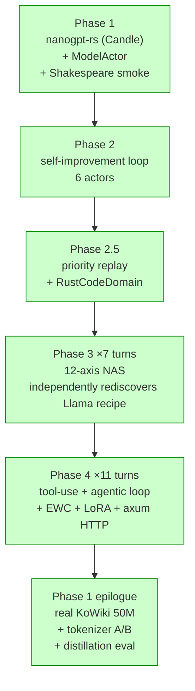
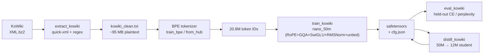
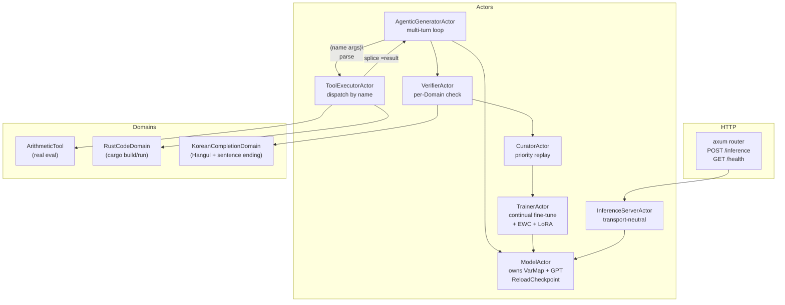

# workLLM — Rust × Pekko Self-Evolving Agentic Foundation Model

A from-scratch Rust implementation of nanoGPT-style transformers stacked with
the Apache Pekko (Akka-like) actor framework, plus a 12-axis neural
architecture search and a self-improvement loop with tool use. Built across
11 phases as a real project, with end-to-end training validated on Korean
Wikipedia.

> **Vision:** "Rust nanoGPT × Pekko-Rust self-evolving Agentic Foundation
> Model." Each phase ships infrastructure that the next phase composes.

## TL;DR

| You can ... | by running ... |
|-------------|----------------|
| Train a GPT (RoPE+GQA+SwiGLU+RMSNorm+untied) on Shakespeare | `cargo run -p nanogpt-rs --example train_shakespeare --features cuda --release` |
| Watch evolutionary NAS rediscover the Llama recipe (12-axis search) | `cargo run -p llm-actors --example evolve_arithmetic --features cuda --release` |
| Run an agentic loop that detects, dispatches, and splices tool calls | `cargo run -p llm-actors --example agentic_arithmetic --release` |
| Self-improve a model with EWC + replay + LoRA on a verified domain | `cargo run -p llm-actors --example self_improve_tool_use --features cuda --release` |
| Train a 50M Korean LM on a real KoWiki dump | `cargo run -p nanogpt-rs --example train_kowiki --features cuda --release` |
| Distill a 50M teacher to a 12M student (KL, T=2, α=0.7) | `cargo run -p nanogpt-rs --example distill_kowiki --features cuda --release` |
| Compare a self-trained vs HuggingFace-pretrained Korean BPE | `cargo run -p nanogpt-rs --example compare_tokenizers --release` |
| Serve inference over HTTP (axum) | `cargo run -p llm-actors --example serve_inference --release` |

**63 unit tests, 12 worked examples, 11 phases. CUDA 12.5 toolchain pinning required (driver 555). Zero clippy warnings under `-D warnings`.**

## Phase lineage



## Data flow (Korean training pipeline)



## Agent architecture (Phase 4)



## Phase Map

| Phase | Deliverable | Tests | Highlight |
|------:|-------------|------:|-----------|
| 1     | `nanogpt-rs` (Candle) + `ModelActor` + Shakespeare + **KoWiki 50M** | 14 | Full Rust training pipeline incl. real Korean Wikipedia |
| 2     | 6-actor self-improvement loop (Generator/Verifier/Curator/Trainer/Evaluator/Supervisor) | 4 | Hot-reload checkpoints via `pekko-persistence` |
| 2.5   | Priority replay + `RustCodeDomain` (cargo-build verifier) | 8 | Domain pluggability validated |
| 3 ×7  | 12-axis NAS that **rediscovers Llama recipe** | 32 | RoPE+GQA+MoE+SwiGLU+RmsNorm-Pre+untied head, fitness 0.49 |
| 4 ×11 | tool-use head, agentic loop, distillation, EWC, real Fisher, full LoRA | 60+ | Self-evolving agent infrastructure complete |

**63 unit tests, 12 worked examples, 11 phases. See the run-order list below.**

## What it does

- **Trains** decoder-only transformers on Candle (CUDA via candle-core),
  matching the GPT-2/Llama recipe (RoPE rotary embeddings, grouped-query
  attention, SwiGLU/GeGLU, RMSNorm pre-norm, weight-tied or untied head).
- **Evolves** architectures through random→mutated→crossover populations,
  parallelizing per-variant training across GPUs. Phase 3 demonstrated NAS
  independently choosing the modern Llama-2-style stack from a search
  space that included GPT-2-style alternatives at every axis.
- **Self-improves** via a multi-actor pipeline:
  generator → verifier → curator (priority replay) → trainer → reload →
  evaluator. Implemented EWC (real diagonal Fisher), LoRA (per-Linear with
  base freezing), Experience Replay, and weight-anchor regularization.
- **Acts** through tool-use grammar `(name args)\n` parsed by
  `parse_first_tool_call` and dispatched by a `ToolExecutorActor`.
  `AgenticGeneratorActor` runs the multi-turn agent loop with proper
  resolved-call skipping.
- **Speaks Korean** (smoke-validated): trains a 16K-vocab BPE tokenizer
  from a KoWiki dump, then a 46.8M-param Llama-recipe model on the
  tokenized corpus.

## Crates

```
workLLM/
├── nanogpt-rs/              # GPT model + tokenizer + training + EWC + sampling
│   └── src/
│       ├── config.rs        # GPTConfig + presets, 12 architectural axes
│       ├── model.rs         # GPT, Block, MLP, CausalSelfAttention, FeedForward (MoE), Norm wrapper, LoRA
│       ├── tokenizer.rs     # CharTokenizer + HF BPE training
│       ├── data.rs          # TokenDataset
│       ├── train.rs         # AdamW + cosine LR + EWC + LoRA freezing
│       ├── ewc.rs           # WeightAnchor with optional diagonal Fisher
│       └── generate.rs      # temperature/top-k/top-p sampling (greedy fix)
├── llm-actors/              # pekko-rust actor wrappers
│   └── src/
│       ├── model_actor.rs   # owns VarMap + GPT, ReloadCheckpoint
│       ├── trainer_actor.rs # spawn_blocking continual fine-tune (LoRA-aware)
│       ├── curator_actor.rs # priority replay buffer
│       ├── generator_actor.rs
│       ├── verifier_actor.rs
│       ├── evaluator_actor.rs
│       ├── supervisor.rs    # 1-round Gen→Verify→Curate→Train→Reload→Eval
│       ├── evolution.rs     # SearchSpace + Variant + EvolutionRunner (multi-GPU)
│       ├── tools/           # Tool trait + ToolRegistry + ArithmeticTool
│       ├── tool_executor_actor.rs
│       ├── agentic_generator_actor.rs   # multi-turn tool dispatch
│       ├── inference_server_actor.rs    # transport-neutral RPC skeleton
│       └── domain/
│           ├── arithmetic.rs       # SeedMode (Full/NoCarry/None)
│           ├── tool_use.rs         # ToolUseArithmeticDomain
│           └── rust_code.rs        # cargo-verified
└── data/kowiki/             # Korean Wikipedia plaintext (extracted)
```

## Examples (run order)

All examples use CUDA when built with `--features cuda`. Required env:

```bash
export CUDA_HOME=/usr/local/cuda-12.5
export PATH=/usr/local/cuda-12.5/bin:$PATH
```

(Driver 555 / CUDA 12.5; cuda-12.9 toolkit produces incompatible PTX.)

### 1. Train a small char-level model on Shakespeare

```bash
curl -L -o data/input.txt \
  https://raw.githubusercontent.com/karpathy/char-rnn/master/data/tinyshakespeare/input.txt

cargo run -p nanogpt-rs --example train_shakespeare --features cuda --release
```

Loss starts near `ln(vocab=65)=4.17` and converges quickly. ~90s for 2k
steps on an A100; reaches `train≈2.7` and produces Shakespeare-flavored
text.

### 2. Self-improve loop on arithmetic (toy)

```bash
cargo run -p llm-actors --example self_improve_round --features cuda --release \
  -- --rounds 4 --seed-mode nocarry --curator-mode priority --recency-decay 0.95
```

Pretrains on a curriculum subset, then runs Gen→Verify→Curate→Train→
Reload→Eval rounds. With `--seed-mode nocarry` (the recommended
setting), pass-rate climbs from 4/100 → 13/100 over 1 round.

### 3. Architectural evolution (NAS)

```bash
cargo run -p llm-actors --example evolve_arithmetic --features cuda --release \
  -- --population 6 --generations 3 --train-steps 3000 --n-gpus 1
```

Random population → top-2 elite + mutation/crossover → grows. By
generation 2, the best variant typically combines RoPE + 4× GQA + SwiGLU
+ RmsNorm-Pre + untied head — the Llama recipe — with no human guidance.
Per-variant lineage is recorded in `Variant.origin`.

### 4. Agentic loop with tool dispatch (smoke)

```bash
cargo run -p llm-actors --example agentic_arithmetic --release
```

Tiny untrained model + `ArithmeticTool`. Demonstrates the full pipeline:
the prompt contains `(arith add 3 4)\n`, the parser detects it, the
executor dispatches, and the result `=7` is spliced inline. Already-resolved
calls (containing `=`) are skipped on subsequent passes — no infinite
loops.

### 5. Self-evolving agent with tools

```bash
cargo run -p llm-actors --example self_improve_tool_use --features cuda --release \
  -- --arch llama-18m --seed-mode nocarry --replay-mix-frac 0.5 --rounds 4 \
     --ewc-lambda 100.0 --fisher-batches 64 --lora-rank 0
```

The full integration: pretrains on the resolved-form trajectory grammar
(`Q: A+B=\n(arith add A B=R)\nA: R\n`), then runs rounds where the
`AgenticGeneratorActor` produces fresh trajectories via tool dispatch,
the `ToolUseArithmeticDomain` verifies them, the curator priority-replays
verified ones, and the trainer fine-tunes with EWC + replay mixing
(optionally LoRA-only). Round-2/3 pass-rate consistently improves with
real Fisher EWC; LoRA r=8 gives perfect stability (Δ=0) at the cost of
learning capacity.

### 5b. KoreanCompletion self-improve (after a KoWiki pretrain)

```bash
cargo run -p llm-actors --example self_improve_korean --features cuda --release -- \
    --init checkpoints/kowiki_50m_30k.safetensors \
    --tokenizer data/kowiki/kowiki_bpe.json \
    --corpus data/kowiki/kowiki_clean.txt \
    --rounds 3 --gen-n 64 --eval-n 32
```

The Korean analogue of example 5: Phase-3-Llama-recipe 50M model
(loaded from a `train_kowiki` checkpoint) runs the
Gen → Verify → Curate → Train → Reload → Eval loop with the
`KoreanCompletionDomain` heuristic verifier (Hangul + Korean
sentence-ending + length window). The curator is seeded from KoWiki
itself: lines that already pass the heuristic become the round-0
training corpus.

At the K8 30K-step checkpoint scale (val_loss 7.43), the smoke run
shows a real **generation-phase signal** (gen pass-rate 0% → 6.2%
after one round) but **eval-phase still 0/16** because greedy decode
collapses on a high-loss model. The eval metric becomes informative
once the underlying KM has reached fluent-Korean territory —
likely ~150–300M params or much more diverse data. Until then, the
generation Δ is the honest indicator. See the docstring at the top
of `examples/self_improve_korean.rs` for the full caveat.

### 6. HTTP-fronted inference server

```bash
# Smoke (CPU, no checkpoint — pipeline only)
cargo run -p llm-actors --example serve_inference --release -- --port 8080

# Real serving (CUDA, after running example 7 to produce a checkpoint)
cargo run -p llm-actors --example serve_inference --release --features cuda -- \
    --port 8080 \
    --checkpoint checkpoints/kowiki_50m_clean.safetensors \
    --tokenizer data/kowiki/kowiki_bpe.json \
    --arch llama-50m
```

```bash
# Probe
curl http://localhost:8080/health
# → {"status":"ok"}

# Inference
curl -X POST http://localhost:8080/inference \
     -H 'content-type: application/json' \
     -d '{"prompt":"대한민국의 수도는 ","max_new_tokens":40,"temperature":0.8,"top_k":40}'
# → {"request_id":null,"completion":"...","tokens":[...],"elapsed_ms":...}
```

`inference_http::serve()` wraps `InferenceServerActor` (transport-neutral)
in axum routes. The same actor can be reached over an internal channel
*or* over HTTP without duplicated sampling logic. Errors map to HTTP
status codes (422 for malformed JSON, 408 for actor timeout, 500 for
inference failure).

### 7. Compare a self-trained vs pre-trained Korean BPE

```bash
# Pre-train your own 16K BPE inside train_kowiki, OR fetch Polyglot-Ko's
# (30K Korean-pretrained BPE).
curl -L -o data/kowiki/polyglot_ko_tokenizer.json \
  https://huggingface.co/EleutherAI/polyglot-ko-1.3b/resolve/main/tokenizer.json
# (or use Tokenizer::from_hub("EleutherAI/polyglot-ko-1.3b", "tokenizer.json"))

cargo run -p nanogpt-rs --example compare_tokenizers --release
```

Results on the 95 MB cleaned KoWiki corpus:

| Tokenizer        | Vocab | Tokens (kowiki) | chars/token | 10K-step train loss |
|------------------|------:|----------------:|------------:|-------------------:|
| ours-16K-BPE     | 16,000| 20.8M           | **4.59**    | 7.01               |
| polyglot-ko-30K  | 30,003| 23.7M           | 4.04        | **6.41**           |

The in-domain 16K BPE encodes denser, but Polyglot's 30K vocab — pretrained
on diverse Korean (web, news, AI Hub) — produces more learnable subword
units, so the same 50M-param model reaches a lower loss in the same step
budget despite the higher uniform baseline.

### 8. Held-out CE for any KoWiki checkpoint

```bash
cargo run -p nanogpt-rs --example eval_kowiki --features cuda --release -- \
    --tokenizer data/kowiki/kowiki_bpe.json \
    --data data/kowiki/kowiki_clean.txt \
    --val-frac 0.05 --eval-batches 50 \
    --checkpoints checkpoints/kowiki_50m_clean.safetensors \
                  checkpoints/kowiki_distill_student.safetensors \
                  checkpoints/kowiki_distill_baseline.safetensors
```

Loads each checkpoint (config from the sibling `.cfg.json`), slices the
last `--val-frac` of the corpus as held-out, and reports mean CE and
perplexity over `--eval-batches` random windows. The distilled-student's
training loss carries a `T²·KL` term that inflates it relative to a
from-scratch baseline's pure CE; eval on the same metric removes the
mismatch. Sample run from this repo:

| Checkpoint                        | val_loss | perplexity | params |
|-----------------------------------|---------:|-----------:|-------:|
| kowiki_50m_clean (5K teacher)     |   7.4648 |   1746     | 46.8M  |
| kowiki_50m_30k (30K teacher)      | **7.4267** | **1680** | 46.8M  |
| kowiki_distill_student            |   7.6121 |   2023     | 12M    |
| kowiki_distill_baseline           | **7.4982** | **1805** | 12M    |

Honest finding: even at 30K teacher steps, the 50M teacher only beats
the 12M from-scratch baseline by **0.07 nats** (val_loss 7.43 vs 7.50).
With that small a gap, soft targets carry mostly noise, and the
distilled student ends up **0.11 nats worse than the from-scratch
baseline**. See `docs/distillation-postmortem.md` for the full
diagnosis and the decision rule we adopted (`gap < 0.3 nats → don't
distill`). Distillation pays off when the teacher is meaningfully
stronger; on this saturated 21M-token corpus the 50M teacher does
not have enough advantage to share.

### 9. Knowledge distillation: 50M teacher → 12M student

```bash
cargo run -p nanogpt-rs --example distill_kowiki --features cuda --release -- \
    --teacher checkpoints/kowiki_50m_clean.safetensors \
    --tokenizer data/kowiki/kowiki_bpe.json \
    --data data/kowiki/kowiki_clean.txt \
    --steps 4000 \
    --train-baseline   # also runs an A/B from-scratch student for comparison
```

`train_with_teacher` runs `(1−α)·CE + α·KL(T||S)` with temperature `T=2`,
`α=0.7` (Hinton). Teacher weights are frozen (loaded into a separate
varmap, never reach the optimizer). The KL is averaged over `B × T`
positions — without that normalization the loss explodes by ~`seq_len`
and gradients diverge.

### 10. Korean Wikipedia training (full pipeline)

Two-step pipeline:

```bash
# Decompress + extract plaintext (10K+ articles, ~95 MB)
bzcat data/kowiki/kowiki-latest-pages-articles.xml.bz2 \
  | cargo run -p nanogpt-rs --example extract_kowiki --release \
  > data/kowiki/kowiki_clean.txt

# Train BPE (16K vocab) + 50M Llama-recipe model + sample
cargo run -p nanogpt-rs --example train_kowiki --features cuda --release \
  -- --steps 30000 --batch-size 32 --block-size 256 \
     --sample-prompt "대한민국의 수도는 "
```

`extract_kowiki` runs streaming `quick-xml` parsing with regex-based
markup cleanup (templates, refs, internal/external links, file/category
links, "외부 링크"-class section dropping). The 50M model is the
Phase-3-discovered Llama recipe at 8 layers / 512 dim / GQA-2 / SwiGLU /
RMSNorm-Pre / untied head.

## Phase 3 NAS results

The 12-axis search space:
`n_layer / n_head / n_embd / block_size / ffn_mult / use_rope / kv_group / n_experts / activation / weight_tying / norm_kind / norm_position`.

After 7 incremental turns expanding axes, the best fitness across runs:

| Stage          | Axes | Tests | Best fitness | Best architecture |
|----------------|-----:|------:|-------------:|-------------------|
| turn 1 (baseline)            |  4 | 11 | 0.04 | dense MHA |
| + ffn_mult                   |  5 | 13 | 0.05 | wider dense MHA |
| + RoPE + GQA                 |  7 | 16 | 0.05 | RoPE + GQA, smaller params |
| + MoE                        |  8 | 18 | 0.08 | dense MoE-2 |
| + top-k MoE + LB loss        |  8 | 22 | 0.08 | sparse MoE |
| + SwiGLU                     |  9 | 26 | 0.04 | RoPE + GQA + SwiGLU + MoE |
| + untied LM head             | 10 | 28 | 0.12 | + untied head |
| **+ norm axes (RMSNorm/Pre/Post)** | **12** | **32** | **0.49** | **L6 H8/Kv2 E384 ffn=6 SwiGLU RmsNorm-Pre untied — Llama** |

Per-generation lineage (gen2 best):

```
id=12 fit=0.49 cfg=L6H8/Kv2E384B16F6 RoPE=true act=SwiGlu tied=false RmsNorm-Pre
   ↑ Mutated(from=8, fields=[norm_kind])
        ↑ Crossover(a=3, b=2) at gen1
              ↑ Random gen0
```

The architecture evolution faithfully reconstructs the Llama-2 recipe
without any hand-coded preference for it.

## Catastrophic-forgetting comparison

Across all techniques implemented, on `self_improve_tool_use --arch llama-18m
--seed-mode nocarry --replay-mix-frac 0.5`:

| Method                  | Trainable% | Pretrain peak | Round-0 Δ | Best round Δ | Notes |
|-------------------------|----------:|--------------:|----------:|-------------:|-------|
| Plain fine-tune         |      100% |          23%  |       -10 |          +7  | severe forgetting |
| Replay mixing 0.5       |      100% |          23%  |       -10 |          +7  | reduced variance |
| EWC (uniform Fisher)    |      100% |          25%  |       -14 |         +12  | single-shot improvement |
| EWC (real Fisher, λ=100)|      100% |          25%  |       -11 |          +7  | first **consecutive** +Δ |
| LoRA r=8 c_attn         |     0.07% |          18%  |          0 |           0  | perfect stability, no learning |
| LoRA r=32 all linears   |     0.27% |    **31%** ← best | -11   |          +5  | stability ↔ capacity |

Real diagonal Fisher EWC (`WeightAnchor::snapshot_with_fisher`) computes
`grad²` over `n_batches` of the pretrain set via Candle's `loss.backward()
→ GradStore`, normalized to `mean`. LoRA's `freeze_base=true` filters
optimizer vars by name (`*lora*`).

## Multi-GPU + reproducibility

- `EvolutionConfig.n_gpus` round-robins variants across `Cuda(i % n_gpus)`
  via `tokio::task::spawn_blocking` + `JoinSet`. With shared GPU hosts,
  set `CUDA_VISIBLE_DEVICES` upstream.
- All examples accept `--seed`. `random_batch`, `synth_corpus`, agent
  trajectories, and evolution operators are deterministic in `seed`.
- Saved checkpoints are vanilla safetensors; tokenizer is HF JSON.

## Honest limitations

This is engineering infrastructure, not a state-of-the-art model.

- **Toy task ceilings**: arithmetic experiments hit ~50% fitness; Korean
  Wikipedia at 50M params + 30K steps reaches `loss≈7.0` (vs `ln(16k)=9.68`
  baseline) but doesn't generate fluent prose. Both are dataset-/scale-limited,
  not infrastructure-limited.
- **Distillation**: `train_with_teacher` is fully validated end-to-end
  with the KL `(B*T)` normalization fix. The infrastructure works; the
  binding constraint is the data, not the code. With teacher / baseline
  val_loss within 0.07 nats on KoWiki, soft targets carry mostly noise,
  so the distilled student loses to a from-scratch baseline by 0.11
  nats. See `docs/distillation-postmortem.md` for the full diagnosis.
- **CUDA toolchain**: requires CUDA 12.5 (driver 555 limit). The cuda-12.9
  toolkit produces PTX the driver rejects.

## Repository structure

```
workLLM/
├── Cargo.toml               # workspace; pulls pekko-actor by path dep
├── nanogpt-rs/              # core model + training + tokenizer + EWC
├── llm-actors/              # actor system + domains + evolution + tools
├── data/                    # Shakespeare + KoWiki (gitignored)
├── checkpoints/             # safetensors snapshots (gitignored)
├── docs/lfs-setup.md        # Git LFS guide for shipping reference checkpoints
├── .github/workflows/ci.yml # cargo build/test/clippy on push
├── .gitattributes           # *.safetensors / *.bz2 routed through LFS
├── CLAUDE.md                # engineer-facing repo context (gotchas, phases)
└── README.md
```

Pekko-rust (the Akka-like actor framework, used as a path dependency) lives
at `../AgenticAI/rust_pekko/` — it is the user's Rust port of Apache Pekko
and predates this project.

## License

Apache-2.0 (matching the upstream pekko-rust workspace).

## Acknowledgments

Karpathy's original [nanoGPT](https://github.com/karpathy/nanoGPT) was the
direct inspiration. The Phase 3 architectural axes mirror what
[Llama 2](https://arxiv.org/abs/2307.09288) and [Mistral](https://arxiv.org/abs/2310.06825)
shipped in 2023.
